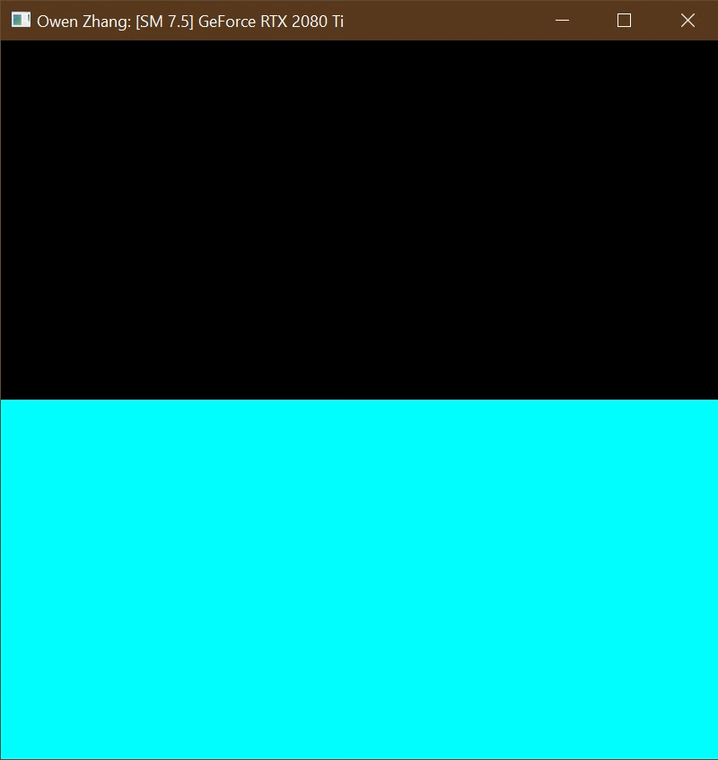
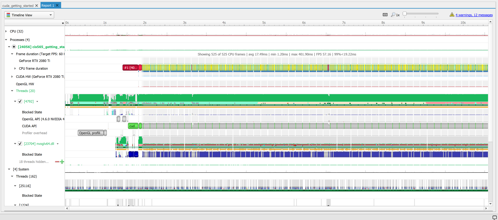
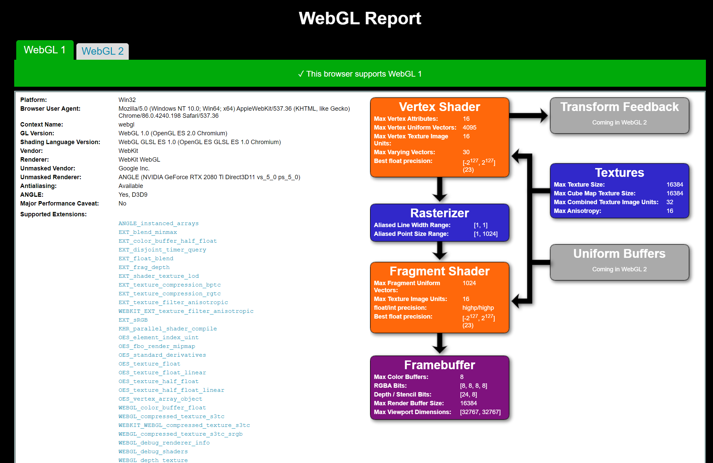
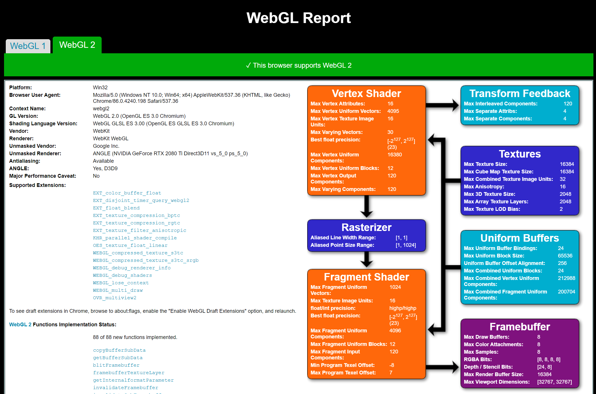
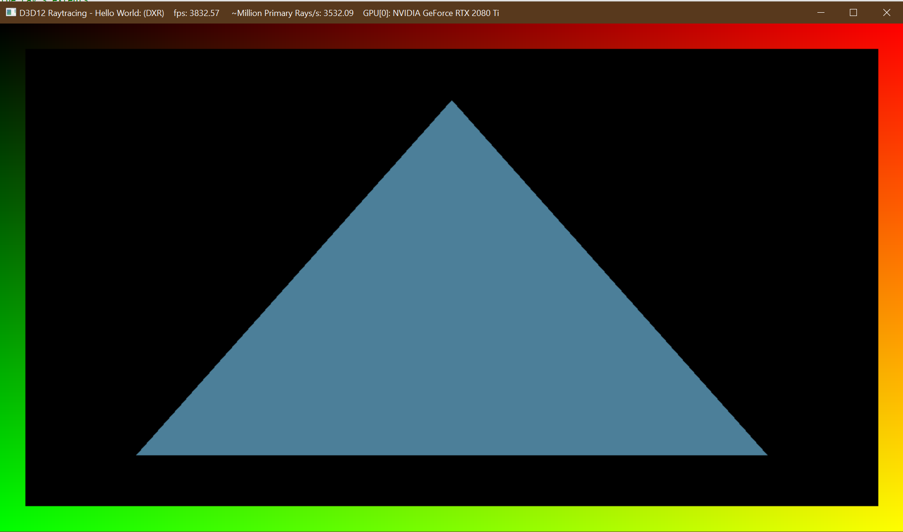

Project 0 Getting Started
====================

**University of Pennsylvania, CIS 565: GPU Programming and Architecture, Project 0**

* Owen Zhang
  * [LinkedIn](https://www.linkedin.com/in/qiaoyu-zhang-71baa672/), [twitter](https://twitter.com/owenqyzhang)
* Tested on: Windows 10 Pro 20H2, Ryzen 9 3950X @ 4.06GHz 64GB, RTX 2080 Ti 11GB x2 

## README

### Part 1 CUDA

#### CUDA Compatibility

#### Nsight Performance Analysis

#### Nsight Debugging

### Part 2 WebGL Compatibility

#### WebGL1

#### WebGL2

### DXR

